# detect-and-eraise
Combine text detection and text erasing. 

The performance still needs to be improved. We can further
- Increase more font common font face in signboards in synthetic data.
- Increase the number of chinese chracters in the character pool in synthetic data.
- Try to include erased and unerased real example.

Performance:

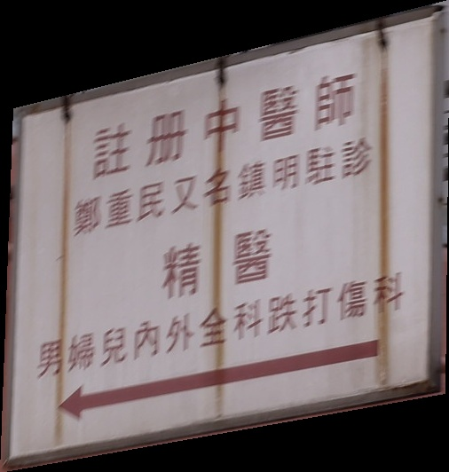
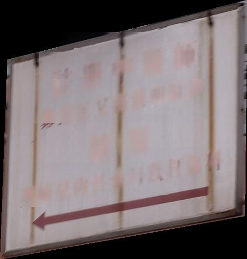

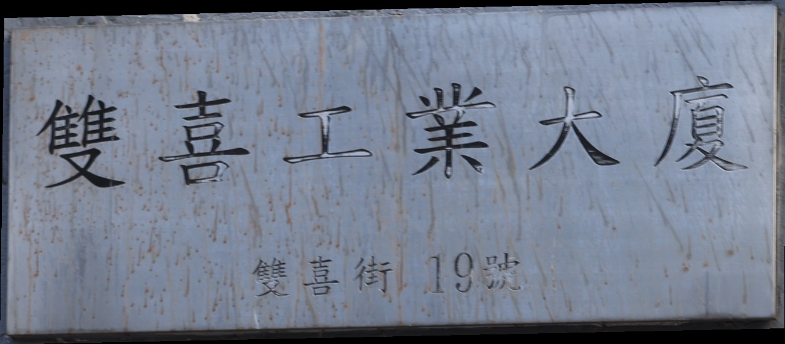
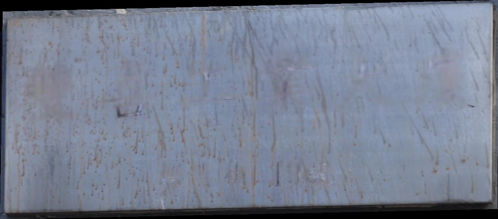

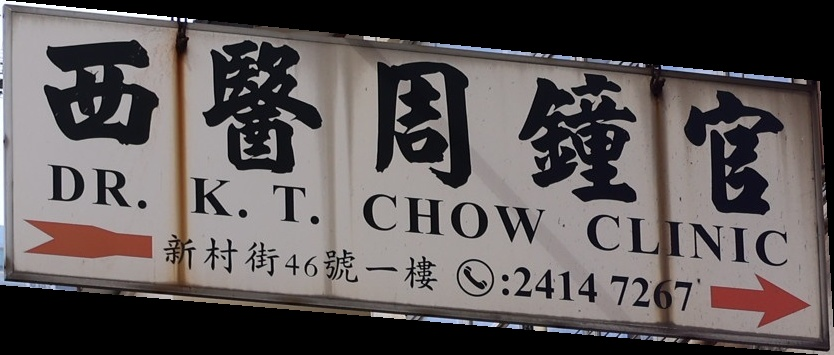
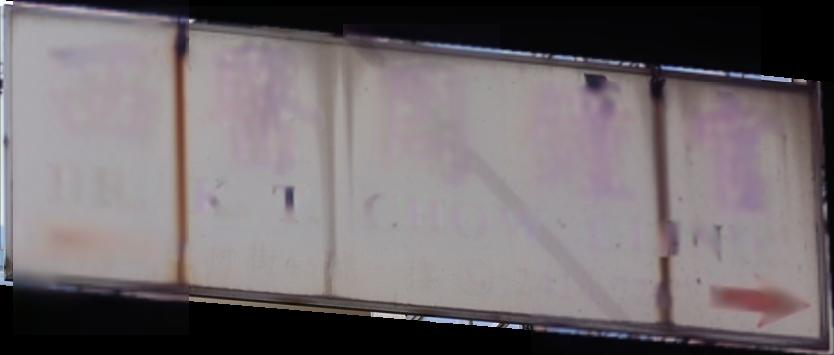

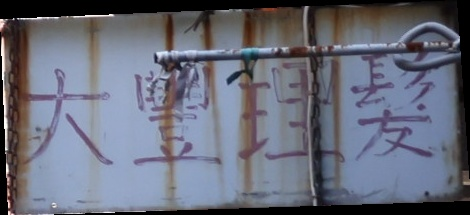
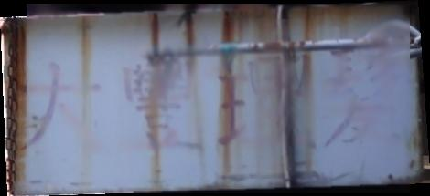

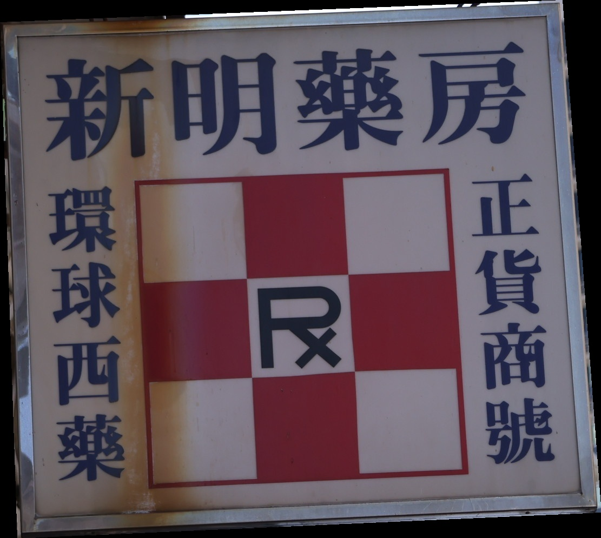
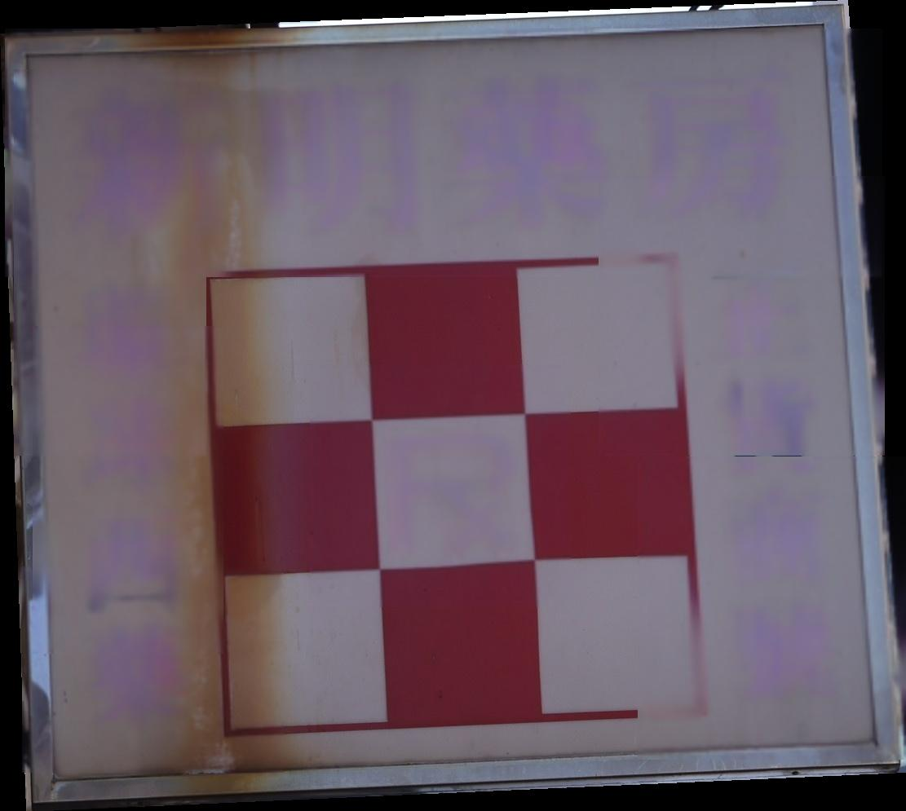

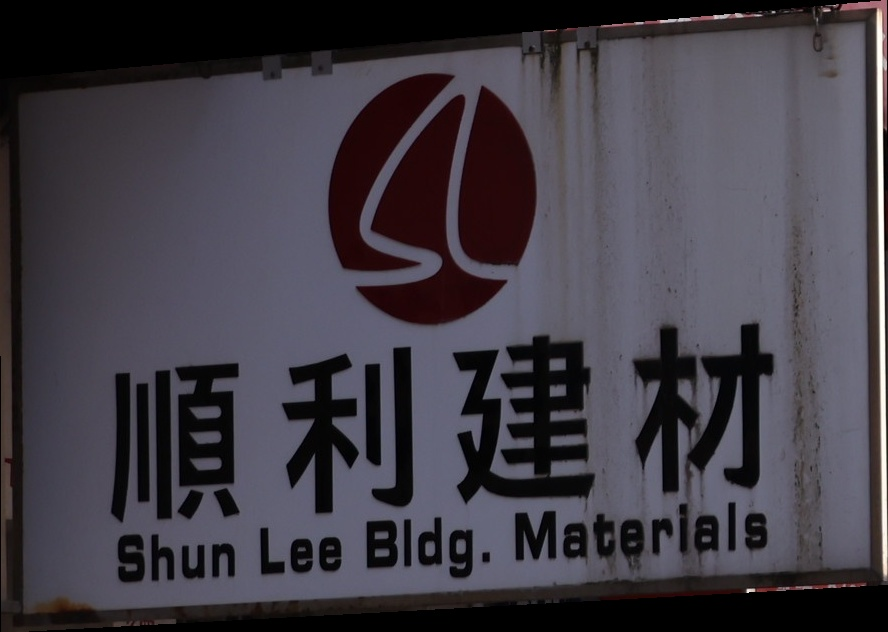
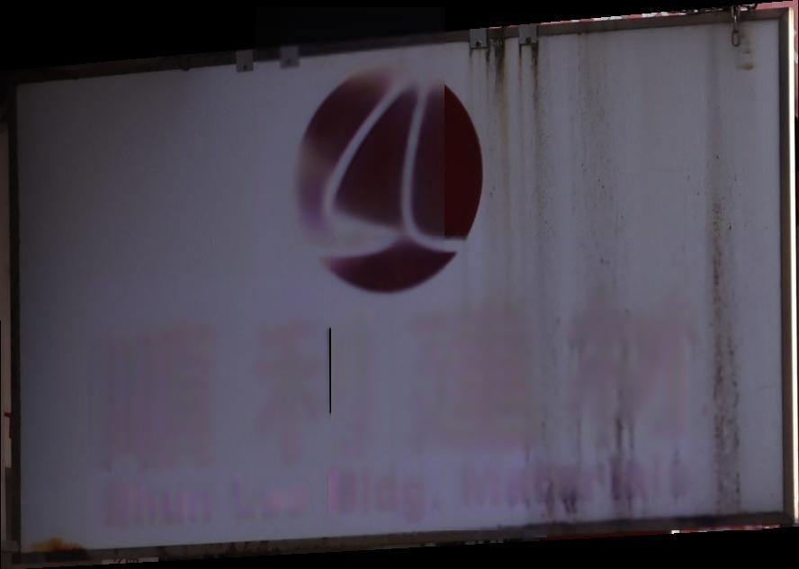

